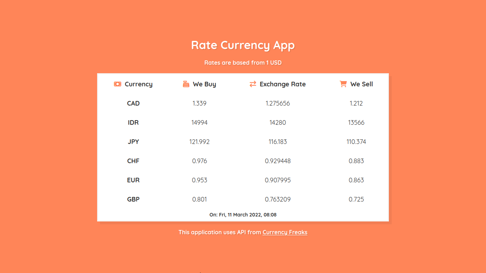

# Rate Currency App - RCTN Assignment 2

Nama: Ahmad Yogi  
Program: React & React Native for Front End Developer  
Fakultas/Universitas: FKIP/Universitas Lambung Mangkurat  

This is an assignment for RCTN Program from Hacktiv8 x Kampus Merdeka

## What this app can do?
- Show currency with base 1 USD to CAD, IDR, JPY, CHF, EUR and GBP
- Show exchange rate for each currencies
- Show buy (5% more than the exchange rate)
- Show sell (5% less than the exchange rate)
This app uses API from [Currency Freaks](https://currencyfreaks.com)

## How to run
If you want to run this, just type:
- `
  $ npm install
` 
- `
  $ npm start
`

## Screenshots

This project is created by __Ahmad Yogi__
